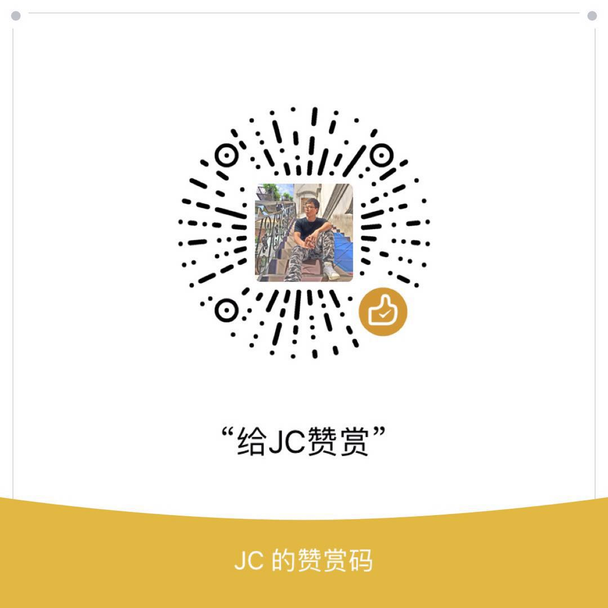

## Introduction
----

BeautyWe 是一套专注于微信小程序的企业级开发范式，它的愿景是：

> 让企业级的微信小程序项目中的代码，更加简单、漂亮。

它由几部分组成：

* **核心** - [BeautyWe Core](https://www.npmjs.com/package/@beautywe/core)    
    对 App、Page 进行抽象和包装，保持传统微信小程序开发姿势，同时开放部分原生能力，让其具有「可插件化」的能力。

* **插件** — [BeautyWe Plugins](https://www.npmjs.com/search?q=keywords%3Abeautywe-plugin)    
    得益于 Core 的「可插件化」特性，封装复杂逻辑，形成可插拔式的插件。官方提供了常见需求的解决方案：如增强存储、发布/订阅、状态机、Logger、缓存策略等。

* **框架** - [BeautyWe Framework](https://www.npmjs.com/package/@beautywe/framework)    
    描述了一种项目的组织形式，开箱即用，集成了 `beautywe core` ，并且提供了如：全局窗口、开发规范、多环境开发、全局配置、NPM 等解决方案。

* **自动化** - [BeautyWe Cli](https://www.npmjs.com/package/@beautywe/cli)    
    提供快速创建应用、页面、插件，以及项目构建功能的命令行工具。

## Usage Example


```shell
$ npm i @beautywe/core @beautywe/plugin-event
```

```javascript
import { BtApp } from '@beautywe/core';
import event from '@beautywe/plugin-event';

const myApp = new BtApp({
    // the code as you write for App()
});

myApp.use(event());

App(myApp);
```

之后，你就能使用 `plugin-event` 提供的能力了：

```javascript
const myApp = getApp();

// now you can listening and trigger an event
myApp.event.on('hello', (msg) => console.log(msg));
myApp.event.trigger('hello', 'I am jc');
```

# Contact & Support


* 欢迎通过邮箱来跟我联系: huangjerryc@gmail.com
* 欢迎通过 [GitHub issue](https://github.com/beautywe/beautywe/issues) 提交 BUG、以及其他问题
* 欢迎给该项目点个赞 ⭐️ [star on GitHub](https://github.com/beautywe/beautywe) !

# Appreciates

<p align="left">
    
</p>

# License

This project is licensed under the [MIT license](https://raw.githubusercontent.com/beautywe/beautywe/master/LICENSE).

Copyright (c) JerryC Huang (huangjerryc@gmail.com)