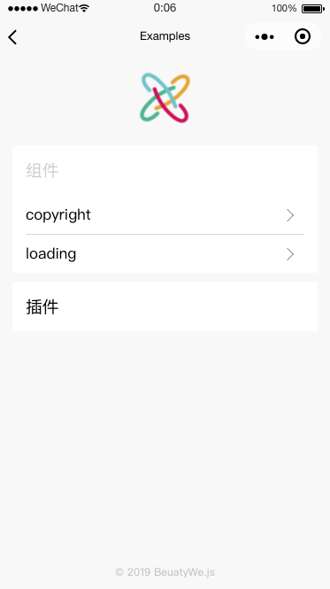

# Example Pages

<div style="display: flex; justify-content: center">
    
</div>

Example Pages 是一套专门用于展示的页面，存放于 `src/exmaple` 目录下。    
它作为一个微信小程序分包，集合了各种组件、插件的可视化展示。    
有时候，我们在多人项目开发中，我们可以通过它来提供公共组件，公共插件的可视化示例，方便使用者上手。

!> `src/example`目录在多环境配置的 `prod` 中，不会被打包到 `dist` 目录中。    
因为线上，绝大部分不会需要这个分包的内容。

## 目录结构

```shell
src/examples/
├── libs
│   └── menu-info.nodepower.js  // 通过 Node.js Power 动态获取 menu 的目录结构信息
└── pages
    ├── home  // 入口页面
    │   ├── index.js
    │   ├── index.json
    │   ├── index.wxml
    │   └── index.wxss
    └── menu  // 菜单页面
        ├── comps  // UI 组件类目
        │   ├── copyright
        │   │   ├── index.js
        │   │   ├── index.json
        │   │   ├── index.scss
        │   │   └── index.wxml
        │   └── loading
        │       ├── index.js
        │       ├── index.json
        │       ├── index.scss
        │       └── index.wxml
        └── plugin  // BeautyWe Plugin 类目
            ├── event
            │   ├── index.js
            │   ├── index.json
            │   ├── index.scss
            │   ├── index.wxml
            │   └── other
            │       ├── index.js
            │       ├── index.json
            │       ├── index.scss
            │       └── index.wxml
            └── listpage
                ├── index.js
                ├── index.json
                ├── index.scss
                └── index.wxml
```

得益于 `libs/menu-info.nodepower.js` 文件，    
只要遵循 `pages/menu/类目/页面/index` 的结构，就能随意扩展「类目」和「页面」，Home 页面就能动态展示出来。