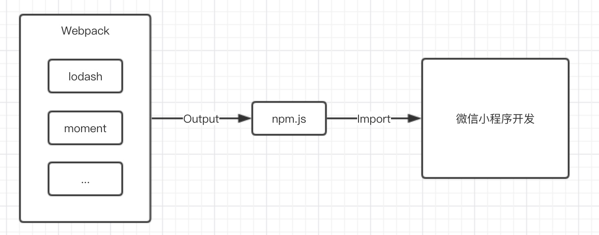

# NPM

BeautyWe Framework 实现支持 npm 的原理很简单，总结一句话：

> 使用 webpack 打包 `src/npm/index.js` ，以 commonjs 格式输出到 `dist/npm/index.js`



这样做的好处：

1. 实现简单。
2. 让 npm 包能集中管理，每次引入依赖，都好好的想一下，避免泛滥（尤其在多人开发中）。
3. 使用 `ll dist/npm/index.js` 命令能快速看到项目中的 npm 包使占了多少容量。

## 新增 npm 依赖

在 `src/npm/index.js` 文件中，进行 export：

```javscript
export { default as beautywe } from '@beautywe/core';
```

然后在其他文件 import：

```javascript
import { beautywe } from './npm/index';
```

## 修改 npm 打包配置

npm 的打包由 webpack、babel 支持，允许通过更新 `/gulpfile.js/config/index.js` 来进行自定义：

```javascript
conf.npm = {
    from: `${APP_DIR}/npm/index.js`,
    to: `${DIST_DIR}/npm`,
    babel: {
        presets: ['@babel/preset-env'],
        plugins: ['array-includes'],
    },
};
```